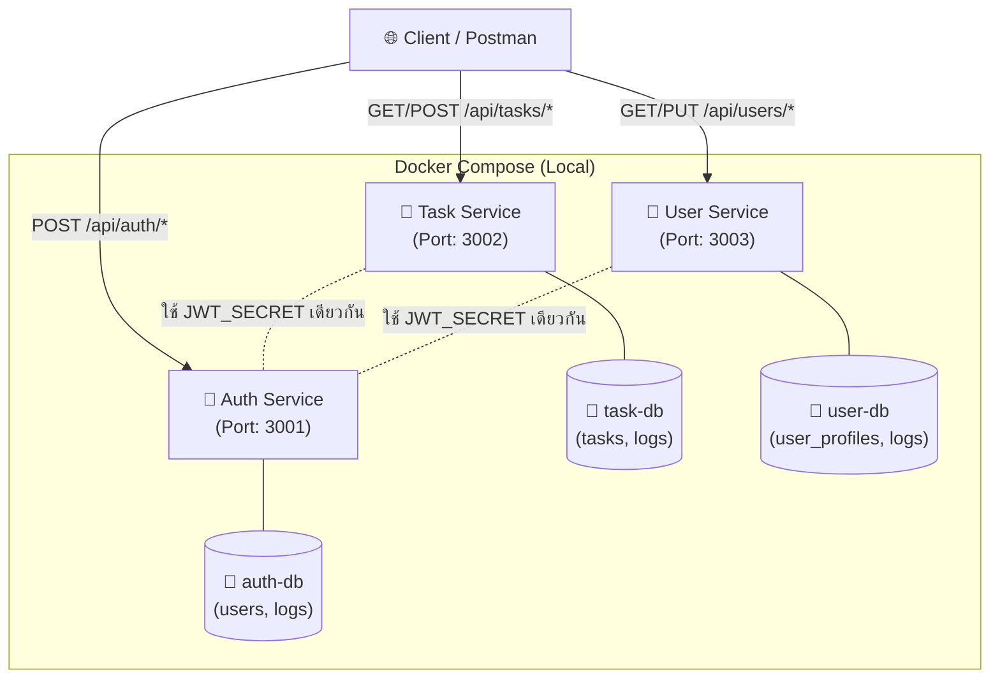

# ENGCE301 Final Lab Set 2: Microservices Scale-Up (Database-per-Service)

## 👤 จัดทำโดย
1. **[อรนุช ลุงหลิ่ง]** รหัสนักศึกษา 67543206031-6
2. **[ชนาธิป ระวิมี]** รหัสนักศึกษา 67543206044-9

*(หมายเหตุ: เนื่องจากข้อจำกัดด้านเวลาในการสอบ กลุ่มของเราจึงเน้นการทำ Phase 1 (Local Test) ให้ระบบ Database-per-Service ทำงานและสื่อสารกันได้อย่างสมบูรณ์ 100% ก่อน)*

---

## 🔗 URL ของ Service (Local Environment)

ระบบได้ทำการแยก Database ออกจากกันอย่างเด็ดขาด และรันผ่าน Docker Compose บนพอร์ตดังนี้:
- **Auth Service**: `http://localhost:3001` (เชื่อมต่อกับ auth-db)
- **Task Service**: `http://localhost:3002` (เชื่อมต่อกับ task-db)
- **User Service**: `http://localhost:3003` (เชื่อมต่อกับ user-db)

---

## 📸 Screenshots (ผลการทดสอบที่สมบูรณ์)
- [1 - ระบบรันครบ 6 Containers (3 Services + 3 DBs)](screenshots/01_docker_running.png)
- [2 - ทดสอบ API Register สำเร็จ](screenshots/02_auth_register_local.png)
- [4 - การตั้งค่า JWT_SECRET เหมือนกันทุก Service](screenshots/09_docker_compose_env.png)

---

## 🚦 Phase 5: Gateway Strategy

กลุ่มของเราเลือกใช้งาน **Option A (Frontend/Client เรียก URL ของแต่ละ service โดยตรง)**
- **เหตุผล:** เนื่องจากสถาปัตยกรรมของเรามีการแยก Port ของแต่ละ Service ไว้อย่างชัดเจน (3001, 3002, 3003) การเรียกใช้งาน API โดยตรงไปยัง Service นั้นๆ จึงมีความรวดเร็ว ลดความซับซ้อนในการตั้งค่า Nginx (Reverse Proxy) และทำให้ง่ายต่อการ Debug ปัญหาของแต่ละ Service แยกกันในระหว่างที่มีเวลาจำกัด

---

## 💻 คำสั่ง curl สำหรับทดสอบ (Local)

**1. สมัครสมาชิก (Register)**
```sh
curl -X POST http://localhost:3001/api/auth/register \
  -H "Content-Type: application/json" \
  -d '{"username":"nuch","email":"nuch@lab.local","password":"password123"}'

```

**2. ล็อกอิน (Login) → เพื่อรับ Token**

```sh
curl -X POST http://localhost:3001/api/auth/login \
  -H "Content-Type: application/json" \
  -d '{"email":"nuch@lab.local","password":"password123"}'

```

**3. เรียกดู Profile (ต้องใส่ Token ที่ได้จากข้อ 2)**

```sh
curl -X GET http://localhost:3003/api/users/profile \
  -H "Authorization: Bearer [ใส่_TOKEN_ตรงนี้]"

```

---

## ☁️ สถาปัตยกรรมระบบ (Database-per-Service Architecture)



---

## 🛠️ ปัญหาที่เจอระหว่างทำ + วิธีแก้ (Real Experience)

| ปัญหาที่พบ | สาเหตุของปัญหา | วิธีแก้ไขที่กลุ่มเราทำ |
| --- | --- | --- |
| **API `/register` ใช้งานไม่ได้**<br>

<br>ระบบฟ้องว่า "อีเมลนี้มีคนใช้แล้ว" ตลอดเวลาทั้งที่เพิ่งสร้างตารางใหม่ | เกิดจากการดักจับ Error ที่ครอบจักรวาลเกินไป (Catch all) ทำให้มองไม่เห็น Error ที่แท้จริง | ทำการแก้ไขโค้ดให้ `console.error` พ่นข้อความที่แท้จริงออกมา ทำให้พบว่าปัญหาคือ `db is not defined` |
| **`db is not defined` / `db.query is not a function**` | โค้ดเดิมจาก Lab 1 ในไฟล์ `auth.js` ใช้ตัวแปรชื่อ `pool` ในการเชื่อมฐานข้อมูล แต่เราก๊อปปี้โค้ดที่ใช้ตัวแปร `db` มาวาง ทำให้ระบบหาฟังก์ชันไม่เจอ | 1. Import ตัวแปร `db` เข้ามาในไฟล์ `auth.js`<br>

<br>2. เปลี่ยนคำสั่งจาก `db.query` ให้เป็น `pool.query` ระบบจึงสามารถบันทึกข้อมูลลงฐานข้อมูลได้สำเร็จ 100% |
| **ข้อมูล User เก่าหายหมด** | การใช้คำสั่ง `docker compose down -v` ทำให้ Volume ของ Database ถูกลบ ข้อมูลเก่าเช่นบัญชี Alice จึงหายไป | เพิ่มระบบ Register ให้สมบูรณ์ เพื่อใช้ในการสร้าง User ใหม่ (nuch) สำหรับทดสอบแทน |

```

---
